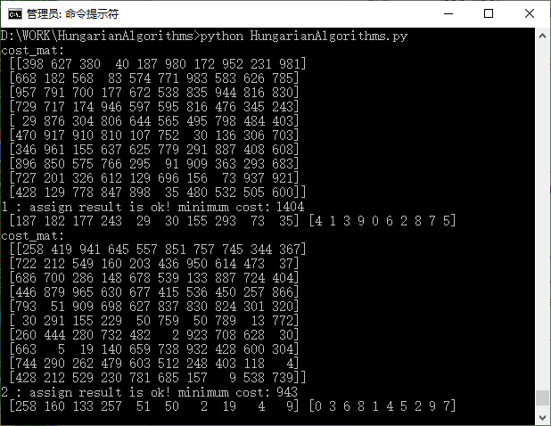

# Hungarian_Algorithms
Hungarian Algorithms
## 运行界面
### Hungarian Algorithms
Hungarian Algorithms 匈牙利算法，1956年Harold Kuhn提出图论的匈牙利方法求解任务分配问题，  
Merrill M. Flood给出匈牙利方法的算法实现步骤(划最少的线覆盖所有的0)  
  
###打开cmd执行命令：  
``` python
python HungarianAlgorithms.py
```  


### KM Algorithms / Kuhn-Munkres Algorithms / Munkres Assignment Algorithms
KM Algorithms / Kuhn-Munkres Algorithms / Munkres Assignment Algorithms  
KM算法 / Kuhn-Munkres算法 / Munkres分配算法，标星0和标撇0(starred zeros and primed zeros)  
  
###打开cmd执行命令：  
``` python
python MunkresAssign.py
```  

